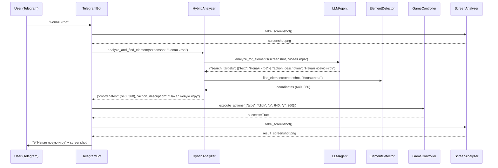

# Архитектура Disco Coop

## Обзор системы

Disco Coop - это гибридная система ИИ для автоматизации игры в Disco Elysium через Telegram бота. Система использует комбинацию анализа LLM и компьютерного зрения для точного определения игровых элементов.

## Основные принципы

### 1. Гибридная архитектура
- **LLM анализ**: Понимание команд пользователя и анализ скриншотов
- **Computer Vision**: Точное определение координат UI элементов
- **Комбинированный подход**: LLM определяет ЧТО искать, детектор находит ГДЕ

### 2. Модульная структура
- Каждый компонент выполняет одну задачу
- Слабая связанность между модулями
- Легкая замена и тестирование компонентов

### 3. Отказоустойчивость
- Graceful degradation при недоступности LLM
- Fallback механизмы для различных сценариев
- Подробное логирование для диагностики

## Компоненты системы

```mermaid
graph TB
    TB[Telegram Bot<br/>disco_bot.py] --> HA[Hybrid Analyzer<br/>hybrid_analyzer.py]
    HA --> LLM[LLM Agent<br/>agent.py]
    HA --> ED[Element Detector<br/>detector.py]
    LLM --> API[External APIs<br/>OpenAI/Anthropic/DeepSeek/Ollama]
    ED --> SA[Screen Analyzer<br/>screen_analyzer.py]
    TB --> GC[Game Controller<br/>controller.py]
    GC --> IS[Input System<br/>PyAutoGUI]
    
    style TB fill:#e1f5fe
    style HA fill:#f3e5f5
    style LLM fill:#e8f5e8
    style ED fill:#fff3e0
    style GC fill:#fce4ec
```



## Детальное описание компонентов

### 1. Telegram Bot (`src/bot/disco_bot.py`)
**Назначение**: Основной интерфейс взаимодействия с пользователями

**Ключевые функции**:
- Получение команд от пользователей в Telegram
- Авторизация и контроль доступа
- Отправка скриншотов и результатов
- Управление сессиями игры

**Workflow**:
1. Получает текстовую команду пользователя
2. Делает скриншот текущего состояния игры
3. Передает данные в HybridAnalyzer
4. Выполняет полученные действия через GameController
5. Отправляет результат пользователю со скриншотом

### 2. Hybrid Analyzer (`src/vision/hybrid_analyzer.py`)
**Назначение**: Координирует работу LLM и детектора элементов

**Алгоритм работы**:
```python
async def analyze_and_find_element(screenshot, command):
    # 1. LLM анализирует команду и скриншот
    analysis = await llm_agent.analyze_for_elements(screenshot, command)
    
    # 2. Извлекаем поисковые цели
    search_targets = analysis['search_targets']
    
    # 3. Детектор ищет точные координаты
    for target in search_targets:
        coordinates = element_detector.find_element(screenshot, target['text'])
        if coordinates:
            return coordinates
    
    # 4. Fallback или ошибка
    return None
```

**Преимущества подхода**:
- LLM понимает контекст и намерения
- Детектор обеспечивает пиксельную точность
- Устойчивость к изменениям UI

### 3. LLM Agent (`src/llm/agent.py`)
**Назначение**: Интерфейс для работы с языковыми моделями

**Поддерживаемые провайдеры**:
- **OpenAI API**: GPT-4o, GPT-4o-mini
- **Anthropic**: Claude 3.5 Sonnet  
- **DeepSeek**: DeepSeek Chat
- **Ollama**: Локальные модели (llama3.1, llava)

**Ключевые методы**:
```python
# Анализ команды и определение поисковых целей
async def analyze_for_elements(screenshot, command) -> Dict:
    return {
        "analysis": "что видно на экране",
        "search_targets": [{"text": "кнопка", "type": "button"}],
        "action_description": "Нажал на кнопку"
    }

# Описание содержимого экрана
async def describe_screen(screenshot) -> str:
    return "Описание экрана на русском языке"
```

### 4. Element Detector (`src/vision/element_detector.py`)
**Назначение**: Поиск UI элементов на скриншотах

**Технологии**:
- **EasyOCR**: Распознавание текста
- **Template Matching**: Поиск по образцам
- **Контурный анализ**: Определение границ элементов

**Алгоритм поиска**:
1. OCR распознавание всего текста на экране
2. Поиск совпадений с целевым текстом
3. Определение границ найденного элемента
4. Вычисление центральных координат для клика

### 5. Game Controller (`src/game/controller.py`)
**Назначение**: Выполнение игровых действий

**Поддерживаемые действия**:
```python
actions = [
    {"type": "click", "x": 400, "y": 300},
    {"type": "key_press", "key": "space"},
    {"type": "type_text", "text": "Hello"},
    {"type": "scroll", "direction": "up", "amount": 3}
]
```

**Особенности**:
- Поддержка множественных дисплеев (Steam Deck + внешний монитор)
- Автоматическое определение игрового окна на любом дисплее  
- Масштабирование координат для разных разрешений

**Обработка координат**:
1. **Исходные координаты** от детектора элементов
2. **+ Автоопределенное смещение** дисплея (если игра на внешнем мониторе)
3. **+ Ручное смещение** из `coordinate_offset` (для тонкой настройки)
4. **× Масштабирование** согласно `display_scaling`

### 6. Screen Analyzer (`src/vision/screen_analyzer.py`)
**Назначение**: Создание и обработка скриншотов

**Функции**:
- Автоматическое определение игрового окна
- Создание временных файлов скриншотов
- Поддержка различных форматов изображений

## Поток данных

### Полный цикл обработки команды:



## Конфигурация и настройки

### Структура конфигурации (`config/config.yaml`):

```yaml
llm:
  provider: "openai"  # openai, anthropic, deepseek, ollama
  model: "gpt-4o-mini"
  vision_model: "gpt-4o"
  analysis_prompt: |
    # Настраиваемый промпт для анализа команд

game:
  window_title: "Disco Elysium"
  multi_display:
    auto_detect_game_screen: true      # Автоопределение дисплея с игрой
    prefer_external_display: true     # Предпочтение внешнего монитора
    coordinate_offset:                 # Дополнительное ручное смещение
      x: 0                            # Добавляется к автоопределенному смещению
      y: 0                            # Используйте для тонкой настройки
    display_scaling: 1.0              # Масштабирование координат

telegram:
  bot_token: "YOUR_TOKEN"
  allowed_chats: [12345]
  admin_users: [67890]
```

## Расширяемость системы

### Добавление нового провайдера LLM:
1. Реализовать методы в `LLMAgent`
2. Добавить конфигурацию в `config.yaml`
3. Обновить проверку доступности

### Добавление нового типа действий:
1. Расширить `GameController.execute_actions()`
2. Обновить промпт для LLM
3. Добавить обработку в `HybridAnalyzer`

### Интеграция с другими играми:
1. Изменить `window_title` в конфигурации
2. Адаптировать промпты под UI игры
3. Настроить детектор элементов

## Производительность и оптимизация

### Время отклика по провайдерам:
- **OpenAI API**: 2-5 секунд
- **Anthropic API**: 3-7 секунд  
- **DeepSeek API**: 1-3 секунды
- **Ollama (локально)**: 30-60 секунд на Steam Deck

### Оптимизации:
- Кэширование скриншотов
- Переиспользование HTTP сессий
- Оптимизация размера изображений для API
- Параллельная обработка где возможно

## Безопасность

### Меры защиты:
- Белый список авторизованных чатов
- Ограничение частоты команд (rate limiting)
- Изоляция игровых действий в рамках окна игры
- Логирование всех действий для аудита

### Конфиденциальность:
- API ключи хранятся в конфигурации (не в коде)
- Скриншоты обрабатываются локально
- Нет сохранения персональных данных пользователей

## Мониторинг и отладка

### Логирование:
```python
# Структурированные логи с уровнями
🧠 LLM команда: Нажал на кнопку начала новой игры
🔍 Поисковые цели: 'Новая игра'
🎯 Найдены координаты: (640, 360) для: Нажал на кнопку начала новой игры
❌ Элементы не найдены на экране: 'Неизвестная кнопка'
```

### Метрики:
- Время отклика каждого компонента
- Процент успешных распознаваний
- Частота использования различных команд
- Статистика по провайдерам LLM

## Будущие улучшения

### Планируемые возможности:
- [ ] Поддержка голосовых команд
- [ ] Интеграция с Discord
- [ ] Автоматическое сохранение прогресса
- [ ] Мультиязычная поддержка
- [ ] Веб-интерфейс для мониторинга

### Технические улучшения:
- [ ] Кэширование результатов LLM
- [ ] Машинное обучение для оптимизации детектора
- [ ] Поддержка видеопотока вместо статичных скриншотов
- [ ] Распределенная архитектура для масштабирования